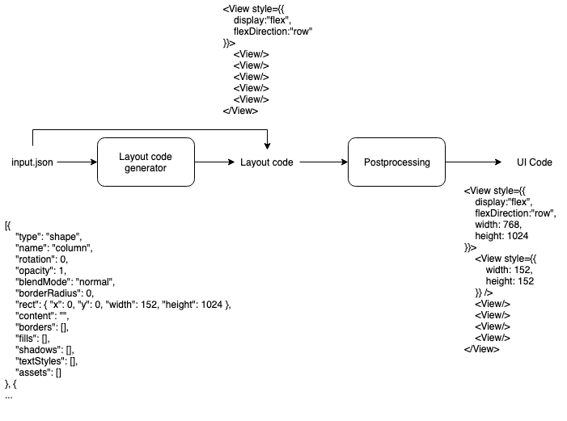

## New approach
This approach includes training a deep learning model to generate layout code and processing outputted layout code to generate meaningful UI code.

## TODOs
#### For layout code generator
We will use seq2seq deep learning model for generating layout code.

* Generating dataset
    * Scrape websites and get ".html" and ".css" files.
    * Generate dataset from these html and css files
        * For an `html`
        * Inputs: For all divs get their `boundedClientRect` and put these to an array.
        * Outputs: For all divs get their related style properties and convert these properties to the defined DSL.
* Training the model
    * Normalize all inputs by dividing `x, y, width, height` properties with the viewport those properties taken.
    * Sort input array with respect to `y` and for all equal `y`s sort with respect to `x`.
    * Decide on the model we will use (will be a variation of `seq2seq`).
    * Output the code in the DSL representing the UI.
* Convert the DSL code into meaningful react native code.

#### For postprocessing part
I don't have a good solution for this problem yet.
* We may try to use some heuristics to match generated code to styles.
* We may try to expand the model to somehow pass `id`s of the inputs to output code.

## Roadmap
- Solve generating layout code problem (till 25th of Match)
- Write midterm report including approaches we've talked about and current state. (till 1st of April)
- Find solutions for postprocessing part. (till 1st of May)
- Write report (15th of May)