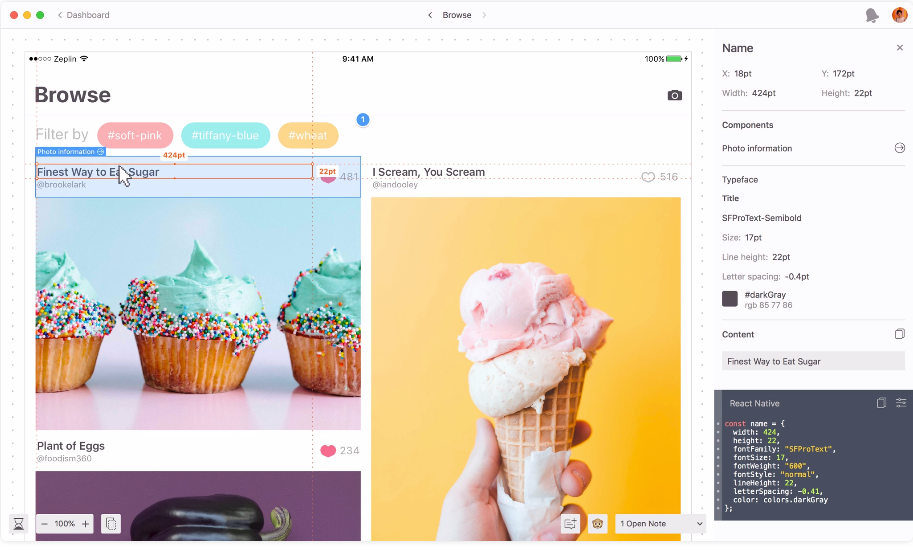

# Zeplin
Zeplin is a tool for product teams that tries to ease the design hand-off process. Design hand-off process includes designer drawing the UI; developer getting the UI specs from the designer and actually implementing it on a platform.

Zeplin automatically generates cumbersome specs (such as "the width of the image in here shall be 130 pixel") and shows those to the developer in a helpful manner. So, it creates a workflow between designer and developer. Designer draws the UI in a tool such as "Photoshop" and uploads that drawing to Zeplin. After that, developer is able to see the specs in Zeplin app.

__Website__: https://zeplin.io/ \
__Screenshot from the app__: \

## Definition of project, screen and component in Zeplin
__Project__ could be thought as the parent entity connecting screens and components. A project could have screens and components. \
__Screen__ is the entity representing an exported design from the design tool. \
__Component__ is the entity representing a design element that can be contained in a screen. A designer also exports components to Zeplin.

## The connection of this project with Zeplin
### Zeplin as a platform
Since the platform shows the designs in a helpful manner. We will be able to inspect screen's data structures visually with the help of Zeplin.

### Zeplin as a data source
Zeplin generates data from Sketch, Photoshop drawings automatically and we will be able to use that data to represent a drawing.

### Zeplin extensions
Zeplin also generates some snippets from the layers of the design with the help of `extensions`. From the [Zeplin extension documentation](https://github.com/zeplin/zeplin-extension-documentation):
> Zeplin extensions are JavaScript modules that generate code snippets from various design elements.

Currently, almost all of our extensions are available as open source and we will be able to use them to generate styles of the components in our project. Specifically [React Native Extension](https://github.com/zeplin/react-native-extension) will be helpful to us.
